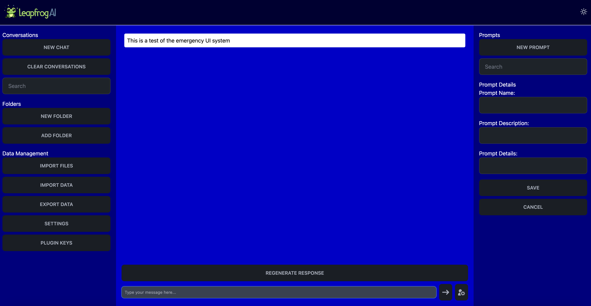

UI Built with SvelteKit, Tailwind CSS with Daisy UI and [Flowbite Svelte](https://flowbite-svelte.com/docs/) for icons.

## Developing

Once you've created a project and installed dependencies with `npm install` or `pnpm install` or `yarn` (in the server folder as well), start a development server:

```bash
npm run dev

# or start the server and open the app in a new browser tab
npm run dev -- --open
```

## Building

To create a production version of your app:

```bash
npm run build
```

You can preview the production build with `npm run preview`.

## Docker (dev env)

```bash
docker pull nginx:alpine
docker build -t ask-frogs .
docker run -i -p 5173:5173 -p 3001:3001 ask-frogs
```

